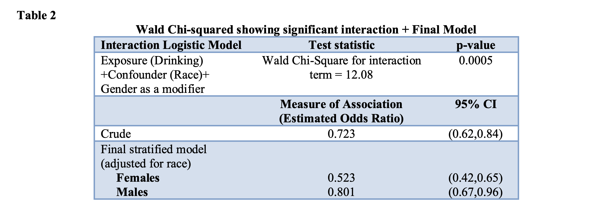

   

  

#### Alcohol consumption demonstrates a protective effect towards hypertension – Assessing the association between alcohol use and high blood pressure in NHANES 2009-2010. 

### Background

Alcohol consumption and has been shown to have diverse and complex effects on cardiovascular
disease and it’s risk factors, including hypertension. While the short-term effect of alcohol on
blood pressure is well established, the risk of hypertension comparing those who drink and don’t
drink is unknown. The goal of the analysis was to examine whether individuals that consume
alcohol have higher risk of hypertension, and whether this association is confounded/modified by
smoking, race, or gender. 

### Methods
Our data source was the NHANES 2009-2010 data set. Our main exposure was alcohol
consumption, a binary variable where drinkers were defined as having >12 drinks/year
(moderate/regular) or having <12 drinks/year (non/light drinkers). Hypertension was defined as
having a systolic measure >140, or diastolic measure >90, or currently taking hypertension
medication. Data was also collected on demographic variables such as age, gender and race.
Logistic regression was used to determine an association between alcohol consumption and
hypertension. Additionally, we adjusted for race/ethnicity and included gender as a modifier. 

### Findings
2607 subjects were examined, with subjects being excluded for missing or extreme variables.
Race was determined to be a confounder and gender was found to modify the association.
Among females, the odds of hypertension for drinkers was 0.523 times the odds of hypertension
for nondrinkers after adjusting for race (95% CI:0.419,0.653). Among males, the odds of
hypertension for drinkers was 0.801 times the odds of hypertension for nondrinkers after
adjusting for race (95% CI:0.669,0.960).

### Interpretation
While there was a significant association between alcohol consumption and hypertension in our
model, the odds of hypertension were found to be higher for non-drinkers, the opposite of our
original hypothesis.

### Conclusion
Alcohol consumption was shown to have a protective effect towards the outcome of
hypertension in the NHANES cohort.

### Tables

  

  

You can find the data and SAS code
[here](https://github.com/aminyakubu/alcohol_vs_hypertension_prj/blob/master/program_alcohol_vs_hp.sas). 

